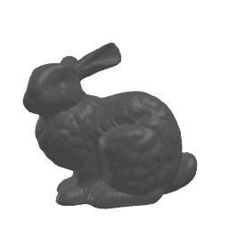

# pymesh2depthmap
A simple tool to create depth-maps out of 3d meshes by using raytracing.

 

### Installation

#### Conda
Conda is recommended to install pyembree (speeds up rendering).

```
conda create -n venv_pym2d python=3.7
conda activate venv_pym2d

# for linux
conda config --add channels conda-forge
conda install -c conda-forge pyembree

# manuall install for windows
git clone https://github.com/scopatz/pyembree.git
cd pyembree
conda install cython numpy
conda install -c conda-forge embree
set INCLUDE=%CONDA_PREFIX%\Library\include
set LIB=%CONDA_PREFIX%\Library\lib
python setup.py install --prefix=%CONDA_PREFIX%
```

And install the necessary pip packages as described following.

#### PIP

It's also possible to just install the pip packages.

```
pip install -r requirements.txt
```
